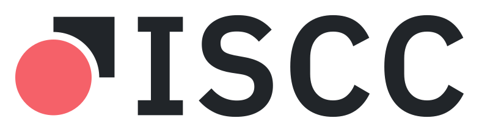

<p align="center">
  <a href="https://iscc.io">
    <picture>
      <source media="(prefers-color-scheme: dark)" srcset="src/assets/iscc-logo-white-coral.svg">
      
    </picture>
  </a>
</p>

<h1 align="center">ISCC C2PA Demo</h1>

<p align="center">
  <b>Match Content Credentials to their content, even after it changes.</b><br>
  An open source demo of the International Standard Content Code (ISCC)<br>
  as a soft binding in C2PA Content Credentials. Inspect and sign images, documents, audio and video.
</p>

<p align="center">
  <a href="https://c2pa-demo.iscc.codes"><b>Download</b></a> ·
  <a href="#motivation">Why</a> ·
  <a href="#what-goes-into-the-manifest">The assertion</a> ·
  <a href="#help-shape-iep-0020">IEP-0020</a>
</p>


<p align="center"><sub>A signed image, opened again. C2PA says <b>Valid</b>, and every ISCC unit in its
soft binding matches the file. Re-encode it at half size and the C2PA hash breaks
(<code>assertion.dataHash.mismatch</code>), but the Content-Code still matches at <b>100%</b> and the
experimental Semantic-Code at 99%. Crop 5% off each side as well and they score 81% and 95%, where
unrelated images score around 50%.</sub></p>

Content Credentials tell you where a file comes from. C2PA ties them to the file by a hash of its
exact bytes. Resize or re-encode the file and the hash no longer matches; strip the manifest and
the credentials are gone.

A **soft binding** links credentials to the content itself, so a service can find the credentials
of a copy again. This demo uses ISCC (ISO 24138:2024), an open content code that anyone can
calculate from the file, without registration. With the app you can:

1. Inspect an image, document, audio or video file: who signed its Content Credentials, when, whether the
   signature holds, and what its ISCC is.
2. Sign a copy whose Content Credentials carry the ISCC and, if you choose, whether AI training and
   data mining is allowed.
3. Check a signed file, changed or not. The app calculates the ISCC again and compares it with the
   one in the Content Credentials, unit by unit.

## Motivation

ISCC has been on the C2PA list of soft binding algorithms as `io.iscc.v0` since 2024. This demo
runs it end to end with [c2pa-rs](https://github.com/contentauth/c2pa-rs), the open source C2PA SDK
of the Content Authenticity Initiative, across 24 file formats.

A watermark has to be embedded in the content and needs a decoder to read it back. An ISCC is
calculated from the content as it is, so you can calculate it again from any copy, with any
implementation of the open standard, and compare.

## What goes into the manifest

The app adds a `c2pa.soft-binding` assertion. Its value is an ISCC-SEQ: the ISCC units of the file
(for an image: Meta-Code, Content-Code Image, Data-Code and Instance-Code, plus the Semantic-Code
Image once it is switched on), each a header and a 256-bit body, concatenated. CBOR stores the value as a byte string; the JSON view shows it in base64.

```json
{
  "label": "c2pa.soft-binding",
  "data": {
    "alg": "io.iscc.v0",
    "blocks": [{ "scope": {}, "value": "AAfn6v8X9v/rPP+/F/v37m7/53f/42Tq+9/rfi59/X//vyEHw0Mw…" }],
    "bindingMetadata": {
      "description": "International Standard Content Code (ISCC - ISO 24138:2024) - Open Source Content Identification",
      "contact": "info@iscc.io",
      "informationalUrl": "https://ieps.iscc.codes/iep-0020/"
    }
  }
}
```

Next to it, the app writes a `cawg.metadata` assertion with the title and description behind the
Meta-Code, an optional `cawg.training-mining` assertion, and an RFC 3161 timestamp. When the file
has a picture (the image itself, the first page of a PDF, a book cover, the thumbnail a document
was saved with, cover art, or a frame of a video), signing also stores a 256 px JPEG thumbnail of it. When you open a signed file, the
Content Credentials tab shows the thumbnail from its manifest next to the file, so you can check
by eye that the two belong together.
[DEVELOPMENT.md](DEVELOPMENT.md#notes-on-the-soft-binding) explains how each unit is calculated
and checked, including whether signing left the original file intact byte for byte.

## Download

Get installers for Windows, macOS and Linux from
**[c2pa-demo.iscc.codes](https://c2pa-demo.iscc.codes)** or the
[releases page](https://github.com/iscc/iscc-c2pa-demo/releases). The builds are not code-signed,
so the download page shows you how to open them the first time.

| Kind | Formats |
|---|---|
| Images | JPEG, PNG, WebP, GIF, TIFF, SVG |
| Documents | PDF, EPUB, DOCX, PPTX, XLSX, ODT, ODS, ODP, TXT, Markdown |
| Audio | MP3, FLAC, WAV, M4A; MP4, MOV and M4V with sound only |
| Video | MP4, MOV, M4V, AVI |

## Good to know

- **The app does not look up credentials.** It compares ISCCs, but it does not find the credentials
  of a stripped copy. That needs a lookup service, which C2PA specifies as the Soft Binding
  Resolution API.
- **The built-in certificate is for testing.** Anyone can check the ISCC, but only this app trusts
  the demo signature. Sign with your own certificate and key for anything real.
- **Signers are checked against the official C2PA trust list.** The app bundles the
  [C2PA trust list and TSA trust list](https://github.com/c2pa-org/conformance-public/tree/main/trust-list),
  plus the c2pa-rs test roots of the demo certificate. A certificate that chains to the C2PA trust
  list shows as "Valid, signer on a trust list". Timestamps are checked against both lists.
- **A matching ISCC shows similar content.** It is a strong signal, not proof, that two files hold
  the same or similar content. It says nothing about who made them or who holds the rights.
- **Video needs ffmpeg, downloaded once.** The MPEG-7 frame signatures behind the Content-Code
  Video, and the tags behind a video's Meta-Code, come from ffmpeg. The first time you open a
  video, the app offers to download the build that iscc-sdk uses (about 70 MB on Windows and
  Linux, 25 MB on macOS) and checks it before it runs. Without it, a video still shows its
  Content Credentials, Data-Code and Instance-Code. ffmpeg is GPL software and runs as a separate
  program; nothing else in the app needs it.
- **Semantic-Codes are experimental and off until you switch them on.** Images and documents
  can also get a Semantic-Code, which matches what a picture shows or what a text says, across
  crops, recolouring, translations and paraphrases. Neural networks compute it on your computer:
  compressed copies of the iscc-sci and iscc-sct models. Settings switches the Semantic-Code
  Image and the Semantic-Code Text on separately; switching one on downloads its model once
  (100 MB for images, 142 MB for text). Their codes may differ from iscc-sci's and iscc-sct's by
  a few bits.
- **A signed PDF keeps the original inside.** c2pa-rs rewrites the whole PDF to embed a
  manifest; this app appends the Content Credentials as a new revision instead, so the original
  stays byte for byte at the start of the signed file and a digital signature already in it stays
  valid for what it signed. A title or description given at signing is written into the PDF
  too, so the Meta-Code describes the file itself. Certified PDFs cannot be signed, as the C2PA
  specification asks.
- **Scanned PDF pages can be read by OCR, switched on in Settings.** A scan has no text layer, so
  without OCR it gets no Content-Code Text, just as in iscc-sdk. With OCR on, the app recognises
  the text of the pages that are scans (Latin script and Chinese) and leaves every other page as
  it is; such codes come from this app alone. The models are built in: nothing is downloaded.
- **Large files show at once.** A video's frames, the hashes of a large file, the
  Semantic-Code and the text of scanned pages are computed after the file is shown, each with its
  own progress bar.
- **Your files stay on your computer.** Inspecting works offline, once ffmpeg and the semantic
  models are there. When you sign, only a hash of the signature goes to a timestamp service.

## For developers

The core is Rust, and the app runs on [Tauri 2](https://tauri.app). It uses
[c2pa-rs](https://crates.io/crates/c2pa) 0.91 with Rust native crypto (no OpenSSL),
[iscc-lib](https://crates.io/crates/iscc-lib) for the ISCC units, pure Rust readers for every
other format, the [pdfium](https://pdfium.googlesource.com/pdfium/) library bundled with the
app for PDF, ffmpeg for video, and [rten](https://github.com/robertknight/rten) with compressed
iscc-sci and iscc-sct models for the Semantic-Codes and with PP-OCRv6 for scanned pages; the app
downloads ffmpeg and the semantic models on first use, the OCR models are compiled in. You need no other tools and no Python. The tests check every ISCC unit against
iscc-core, the ISCC reference implementation, iscc-sdk, iscc-sci and iscc-sct.

The same core builds as `c2pa-iscc`, a command-line tool that prints JSON.

```sh
pnpm install
uv run scripts/fetch_resources.py                                            # pdfium and the OCR models, once
pnpm tauri dev                                                               # the app
cd src-tauri && cargo run --features cli --bin c2pa-iscc -- sign photo.jpg   # the CLI
```

Start with [`src-tauri/src/sign.rs`](src-tauri/src/sign.rs), which builds the assertion, and
[`src-tauri/src/inspect.rs`](src-tauri/src/inspect.rs), which reads it back.
[DEVELOPMENT.md](DEVELOPMENT.md) covers requirements, the CLI, tests, timestamps and releases.

## Help shape IEP-0020

[IEP-0020](https://ieps.iscc.codes/iep-0020/) defines how an ISCC is stored in a C2PA manifest, and
it is still a draft. If you try the demo on files you know or reuse the code, tell us what worked
and what didn't. Open an [issue](https://github.com/iscc/iscc-c2pa-demo/issues) or write to
info@iscc.io.

## Licence

This is a technology demonstration, provided as is and without warranty (see sections 7 and 8 of
the licence). The [ISCC Foundation](https://iscc.io) releases it under Apache-2.0, see
[LICENSE](LICENSE). The ISCC logos are marks of the ISCC Foundation and are not covered by the
licence. Third-party fixtures, certificates and fonts keep their own licences, listed in
[DEVELOPMENT.md](DEVELOPMENT.md#licences).
